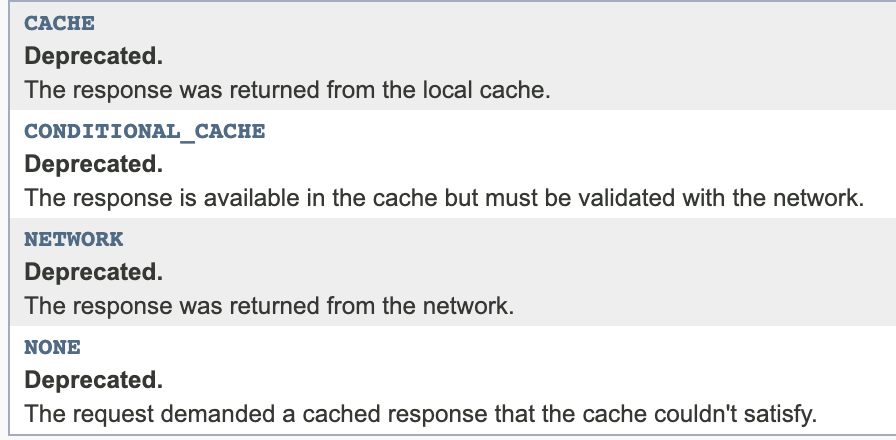
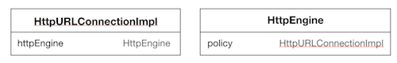

# OKHttp 1.0.0 디버깅
OkHttpUrlConnection의 getContentType() 메소드를 따라 OkHttp에서 어떻게 request와 response를 수행하는지 훑어보자 ! 
자세한 사항을 알고 싶다면, 직접 디버깅하는게 최선이다...

## 수정중입니다,, !

## OkHttpUrlConnectionImpl#getResponse()
### initHttpEngine()
  - HttpEngineFailure가 존재한다면 해당 Exception 발생
  - connected = true;
  - doOutput이 true인 경우, POST/PUT 메소드로 변환
  - *HttpEngine 생성*
  
### HttpEngine을 반환한다.
HttpEngine이 ResponseHeaders를 가지고 있을 경우, HttpEngine을 그대로 반환해주지만 
앞서 initHttpEngine()에서 HttpEngine을 새로 생성했기 때문에 반환할 일이 없다 !

### execute()
``` java
/**
 * Sends a request and optionally reads a response. Returns true if the
 * request was successfully executed, and false if the request can be
 * retried. Throws an exception if the request failed permanently.
 */
```
execute() 메소드에서는 httpEngine의 sendRequest(), readResponse() 메소드를 수행한다. 
이 때 httpEngine에게 responseSource 값이 존재한다면, sendRequest()을 생략한다. 

> responseSource은 ?
> response의 상태값을 enum으로 나타낸다. 
> 
> 
> 참고로 OKHttp 2.0부터는 제거되어 networkResponse(), cacheResponse() 메소드로 대체한다.

#### sendRequest()
- prepareRawRequestHeaders() : 
  requestHeaders의 기본 헤더 디폴트 값 설정, cookieHandler에 따라 쿠키 기본 설정
- initResponseSource() : 
  responseSource를 NETWORK로 초기화한 후, cache관련 헤더 정보에 따라 CACHE | CONDITIONAL_CACHE로 설정한다.
  설정된 값에 따라 응답 캐쉬값을 응답값으로 설정한다. 
- 요청 헤더에 only-if-cached 헤더가 존재할 경우, [only-if-cached 헤더 정책](http://www.w3.org/Protocols/rfc2616/rfc2616-sec14.html#sec14.9.4)에 따라 
  gateway-timeout 이슈를 발생시킨다. 
 
- sendSocketRequest() : 
  connect() 메소드 실행 
    - Https인 경우, SSLSocketFactory/HostnameVerifier 할당
    - address와 routeSelector 객체 생성 후, next() 메소드를 이용해 connection 생성
    - socket(proxy 타입에 따라) 생성 및 연결, timeout 설정
    - **proxy가 만약 바뀐다면 requestLine을 재설정**(흥미로운 부분이다.)
  transport 생성 및 POST, PUT 요청에 따른 requestBody 생성
  


#### sendResponse()
- requestBodyOut이 RetryableOutputStream이라면 contentLength 설정
- transport.writeRequestHeaders()
>
``` java
/**
 * Prepares the HTTP headers and sends them to the server.
 **/

public void writeRequestHeaders() throws IOException {
  httpEngine.writingRequestHeaders();
  RawHeaders headersToSend = httpEngine.requestHeaders.getHeaders();
  byte[] bytes = headersToSend.toBytes();
  requestOut.write(bytes);
}
```
- requestBodyOut가 null이 아니고 RetryableOutputStream이라면 close(), writeRequestBody()까지 수행
- transport.readResponseHeaders() : responseHeaders를 socketInputStream을 통해 읽어와 생성한다.
``` java
@Override public ResponseHeaders readResponseHeaders() throws IOException {
  RawHeaders headers = RawHeaders.fromBytes(socketIn);
  httpEngine.connection.setHttpMinorVersion(headers.getHttpMinorVersion());
  httpEngine.receiveHeaders(headers);
  return new ResponseHeaders(httpEngine.uri, headers);
}
```
- responseSource가 CONDITIONAL_CACHE이고 cache 사용이 필수 -> 가능하다면, 캐싱 진행

### !?!
connectionPool 재반납
httpEngine.release(false);


---

### HttpEngine과 HttpURLConnectionImpl의 관계는 ?


HttpEngine의 policy라는 HttpURLConnectionImpl을 가진다.
해당 변수는 HttpEngine이 HttpURLConnectionImpl의 initHttpEngine() 메소드에 의해 생성될 때, 바로 그 HttpURLConnectionImpl을 복사하여 할당한다.

 

> 디버깅하면서 간간히 발견했던 불필요한 조건 체크 같은 건 아래 if문을 보고 싹 잊어버렸다..
``` java
// RouteSelect#next

// Compute the next route to attempt.
if (!hasNextTlsMode()) {
  if (!hasNextInetSocketAddress()) {
    if (!hasNextProxy()) {
      if (!hasNextPostponed()) {
        throw new NoSuchElementException();
      }
      return new Connection(nextPostponed());
    }
    lastProxy = nextProxy();
    resetNextInetSocketAddress(lastProxy);
  }
  lastInetSocketAddress = nextInetSocketAddress();
  resetNextTlsMode();
}
``` 
