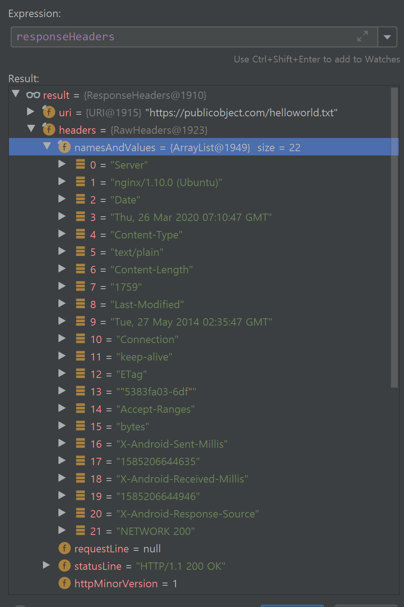

### okHttp 와 redirect 🙂

서버에서 ssl 설정을 하는 경우, `http`로 요청하는 경우 `https`로 redirect 시켜준다.
okHttp는 redirect를 어떻게 처리할까 ?

#### redirect의 전반적인 프로세스

- open 및 http 요청 ("http://publicobject.com/helloworld.txt")
    - httpEngine 생성
    - request 를 보내고, response를 받는다.
- response 확인 : HttpUrlConnectionImpl.getResponse()
    
    - response code 301과 nameAndValues 의 Location 필드를 주목하자.
    - redirect를 "https://publicobject.com/helloworld.txt"로 하라고 response 왔다.
> HTTP 응답 상태 코드 301 Moved Permanently는 영구적인 URL 리다이렉션을 위해 사용되며, 
> 즉 응답을 수신하는 URL을 사용하는 현재의 링크나 레코드가 업데이트되어야 함을 의미한다.
> 이 **새 URL은 응답에 포함된 위치 필드에 지정되어야 한다.**
> 301 리다이렉트는 사용자가 HTTP를 HTTPS로 업그레이드하게 만드는 최상의 방법으로 간주된다
> 
> 참조 : [https://ko.wikipedia.org/wiki/HTTP_301](https://ko.wikipedia.org/wiki/HTTP_301)

- Retry 여부 확인
    - MAX_REDIRECT = 20
```
if (!getInstanceFollowRedirects()) {
    return Retry.NONE;
  }
  if (++redirectionCount > MAX_REDIRECTS) {
    throw new ProtocolException("Too many redirects: " + redirectionCount);
  }
  if (responseCode == HTTP_TEMP_REDIRECT && !method.equals("GET") && !method.equals("HEAD")) {
    // "If the 307 status code is received in response to a request other than GET or HEAD,
    // the user agent MUST NOT automatically redirect the request"
    return Retry.NONE;
  }
// Location 확인
  String location = getHeaderField("Location");
  if (location == null) {
    return Retry.NONE;
  }
  URL previousUrl = url;
  url = new URL(previousUrl, location);
  if (!url.getProtocol().equals("https") && !url.getProtocol().equals("http")) {
    return Retry.NONE; // Don't follow redirects to unsupported protocols.
  }
  boolean sameProtocol = previousUrl.getProtocol().equals(url.getProtocol());
// !false && !true 
  if (!sameProtocol && !followProtocolRedirects) {
    return Retry.NONE; // This client doesn't follow redirects across protocols.
  }
// true
  boolean sameHost = previousUrl.getHost().equals(url.getHost());
// false
  boolean samePort = getEffectivePort(previousUrl) == getEffectivePort(url);
  if (sameHost && samePort && sameProtocol) {
    return Retry.SAME_CONNECTION;
  } else {
// 최종 return!!
    return Retry.DIFFERENT_CONNECTION;
  }
```
- `Retry.DIFFERENT_CONNECTION`인 경우, `automaticallyReleaseConnectionToPool`를 `true`로 변경
  (자동으로 ConnectionPool에 반환하라는 의미 (?))
```
if (retry == Retry.DIFFERENT_CONNECTION) {
// automaticallyReleaseConnectionToPool = true로 전환
    httpEngine.automaticallyReleaseConnectionToPool(); 
}
```
> 소켓 연결이 더 이상 필요하지 않을 때 소켓 연결이 연결 풀로 해제되도록 하십시오.
> 만약 그것이 이미 필요 없다면, 즉시 풀링될 것이다. 그렇지 않으면 동일한 연결로 리디렉션을 처리할 수 있도록 연결이 유지된다.

- 기존의 HttpEngine 반환
> 리소스를 재사용하거나 폐쇄할 수 있도록 이 엔진을 해제하십시오.
> 연결을 리디렉션에 사용하지 않는 한 {@link #automaticallyReleaseConnectionToPool}을(를) 호출하십시오.

    - HttpEngine의 connection을 null 처리(connectionPool에 반환)
- 신규 HttpsEngine 생성
- https 요청 ("https://publicobject.com/helloworld.txt")
    - httpEngine.sendRequest and httpEngine.readResponse
- 최종 응답 받게 됨 !

    - response code = 200
    - Retry = Retry.NONE
        - `httpEngine.automaticallyReleaseConnectionToPool();`