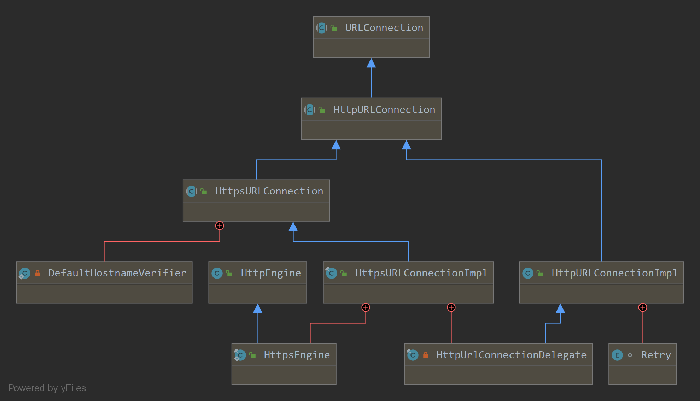
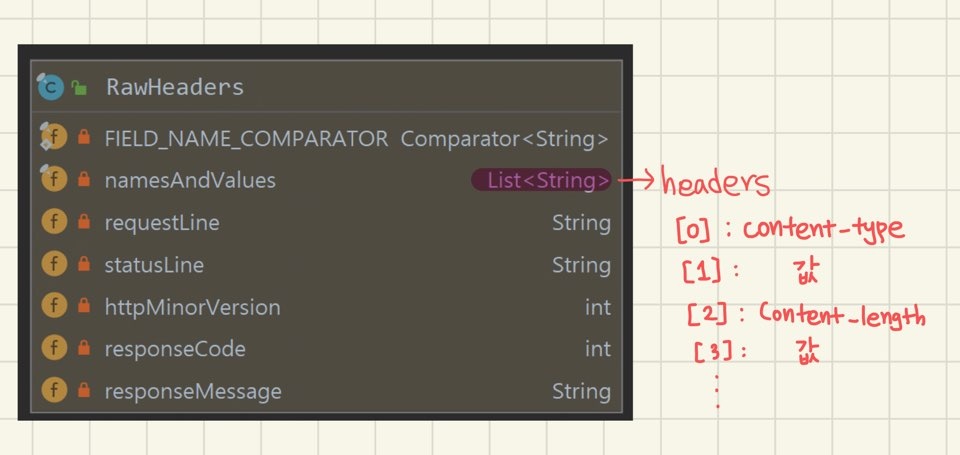
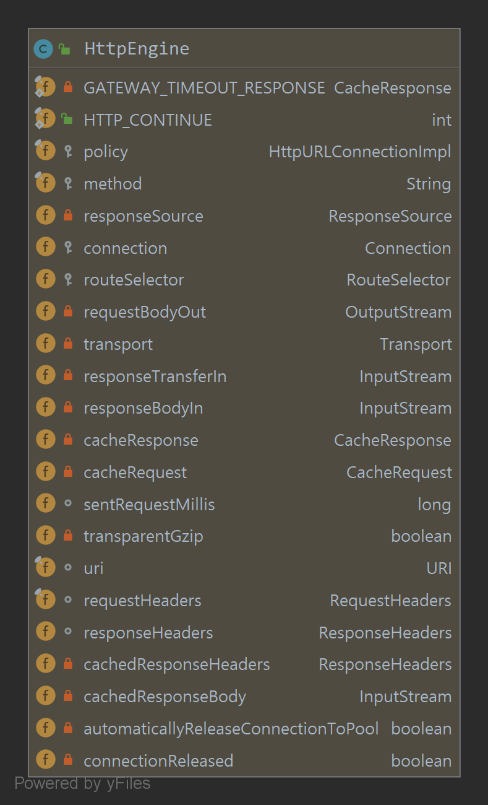

### 🤔 okHttp 디버깅 하기에 앞서

> 주절주절 적어보기,,

- client 에서 어떻게 request header 생성 ?
- response header 파싱은 어떻게 할까
- header를 어떻게? 어떤? 구조체로 관리할까
- connection과 timeout에 대한 설정
- CRLF 구분은 어떻게 할까 (http 메시지의 끝은 어떻게 파악할까)
- http / https 에 따라 어떻게 달라질까
- 이로써 okHttp 전체 흐름 파악

### 궁금한 것들 해결해나가기 🙂

#### okHttp 전체 흐름 파악하기



1. `new OkHttpClient().open(..)`을 통한 `OkHttpClient` 생성
    - `copyWithDefaults()` 얕은 복사를 통해 생성되며, 각 필드에 대해 시스템 전체 기본값을 할당한다.
2. protocol 에 따라 `HttpURLConnection`의 구현체를 return 한다.
    - 2-1. http : HttpURLConnectionImpl
    - 2-2. https : HttpsURLConnectionImpl
    - 2-3. http/https 아닌 경우 exception
3. `HttpsURLConnectionImpl(HttpURLConnectionImpl)`에서는 `HttpsEngine(HttpEngine)`을 사용하여 요청을 보내고 응답을 수신한다.
    이 때, `connected`변수의 의미는 연결 되어 있는 지의 여부가 아닌, 연결이 시도된 적 있는 지의 여부이다.
    (연결을 시도한 이후엔 요청 헤더 필드, 요청 방법을 수정할 수 없다.)
    - 3-1. `initHttpEngine()`
        - 3-1-1. connected = true
        - 3-1-2. return `HttpsEngine`
    - 3-2. `sendRequest()` : 요청
        - 3-2-1. `prepareRawRequestHeaders()` : request header 준비
        - 3-2-2. `sendSocketRequest()` : 요청
        - 3-2-3. `setResponse`
        - 3-2-4. `initResponseSource()`
            - 캐싱 되어 있으면 캐시에서 읽기
            - `sendSocketRequest()` socket 요청 & connect()
    - 3-2. `readResponse()` : 응답 읽기
            
`HttpUrlConnectionDelegate` 는 `HttpURLConnectionImpl`의 재사용을 허락한다. 
`HttpURLConnectionImpl`가 생성될 때 초기화 된다.

#### 헤더 뜯어보기


- header 는 `List<String>` type으로 선언되어 있음
- 따라서, 특정 헤더 검색은 아래 코드와 같이
``` java
public final class RawHeaders {
    public String get(String fieldName) {
        for (int i = namesAndValues.size() - 2; i >= 0; i -= 2) {
          if (fieldName.equalsIgnoreCase(namesAndValues.get(i))) {
            return namesAndValues.get(i + 1);
          }
        }
        return null;
    }
}
```

- 쉼표와 같은 구분 자 처리는?
> This class tracks fields line-by-line. A field with multiple comma-separated values on the same line will be treated as a field with a single value by this class. It is the caller's responsibility to detect and split on commas if their field permits multiple values. This simplifies use of single-valued fields whose values routinely contain commas, such as cookies or dates.
>
> 같은 라인에 여러 개의 쉼표로 구분된 값을 가진 필드는 이 클래스에 의해 단일 값을 가진 필드로 처리된다.

**✔ 요청 헤더**
- default 값 처리해 줌
    - user-agent
    - host
    - connection = 'Keep-alive'

**✔ 응답 헤더**
- nameAndValues
- statusLine
- responseCode
- OK

- 마지막 줄 확인은?
`line.length() != 0`

#### okHttp 에서는 `getResponse()`시 connection 을 맺는다.
> Aggressively tries to get the final HTTP response, potentially making many HTTP requests in the process in order to cope with redirects and authentication.
>
> 리디렉션 및 인증에 대처하기 위해 프로세스에서 많은 HTTP 요청을 할 수 있는 최종 HTTP 응답을 적극적으로 얻으려고 한다.

#### `HttpEngine`


