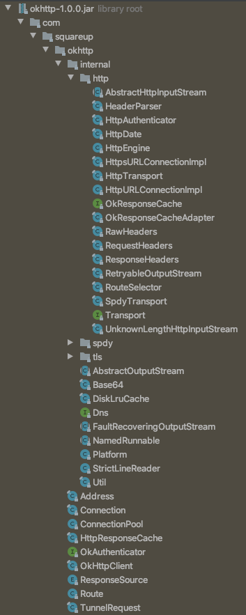

# ok-http


### package 구조
http


### Returns a shallow copy of this OkHttpClientReturns a shallow copy of this OkHttpClient
1. 클라이언트 생성
2. open(URL) : URL 을 받아, 프로토콜에 맞는 HttpURLConnection 의 구현체를 반환. 커넥션풀도 여기서 세팅
3. getResponse() : 
    1. initHttpEngine() : http 엔진 초기화
    2. execute(), sendRequest() : 요청 보내기
        1. 요청헤더 준비
        2. ResponseSource : 캐시정책 체크
        3. sendSocketRequest() : Connection.connect() : 실제 소켓을 생성하여 맺음 (플랫폼맏ㄷ ㅏㅏㄹㄴ maximum transmission unit of the network interface)
        4. request line 세팅
        5. Transport.class createRequestBody() : 실제 스트림 전송을 담당. 요청 쓰기
        6. 
    3.  readResponse() : bodyㄱ ㅏ없으면 여기서 요청????????
    4. retry
    5. 
        
    
    
    
    
### initHttpEngine
new HttpEngine() 하면서 타임아웃에 대한 응답을 미리 만들어 놓는다?!
```
      Map<String, List<String>> result = new HashMap<String, List<String>>();
      result.put(null, Collections.singletonList("HTTP/1.1 504 Gateway Timeout"));
      Map<String, List<String>> result = new HashMap<String, List<String>>();
      result.put(null, Collections.singletonList("HTTP/1.1 504 Gateway Timeout"));
```
 
